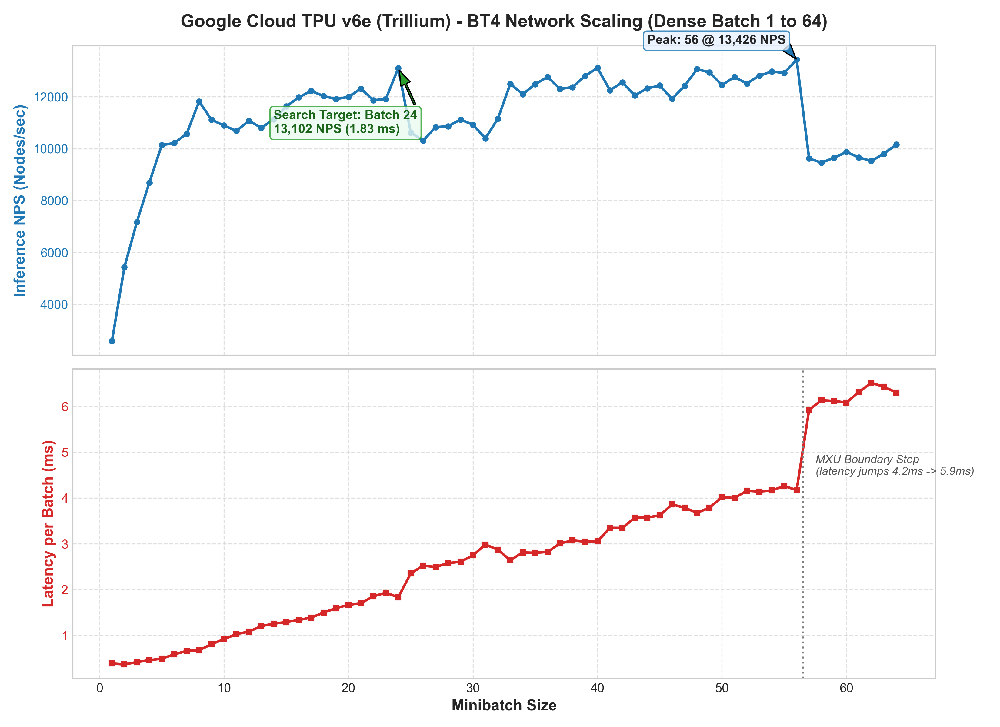

# Google Cloud TPU v6e (Trillium) Leela Chess Zero Benchmarks

## Overview
Performance benchmark results of Leela Chess Zero (`lc0`) on Google Cloud TPU v6e (Trillium) using the `xla` and `demux` backends with multi-core PjRT execution.

- **Network**: BT4 (`BT4-1024x15x32h-swa-6147500.pb.gz`)
- **Precision**: BF16 (Native TPU bfloat16)
- **Engine Version**: lc0 v0.34.0-dev+git.fa36794d (branch: `lucario6607/lc0-sc:tpu`)
- **Accelerator**: Cloud TPU v6e (Trillium), evaluated on single chip (`v6e-1`) and full 8-chip slice (`v6e-8`).

---

## 1. Benchmark Results

### Full Search Benchmark (`lc0 benchmark` on 8x TPU v6e)
MCTS tree search with 8 search threads across all 8 TPU v6e chips connected via the `demux` multiplexer backend:

```text
Backend: demux (8x TPU v6e-8, 24 batch per TPU, combined 192 minibatch)
Threads: 8
Weights: BT4-1024x15x32h-swa-6147500.pb.gz

Total time (ms) : 340462
Nodes searched  : 36,458,000
Nodes/second    : 107,084 NPS
Peak position   : 120,309 NPS
```

### Backend Throughput Benchmark (`lc0 backendbench`)

| Hardware Configuration | Minibatch Size | Mean Throughput | Mean Latency |
| :--- | :--- | :--- | :--- |
| **8x TPU v6e (`demux`)** | **192 (8 x 24)** | **59,144 NPS** | **3.25 ms** |
| 1x TPU v6e-1 | 56 | 13,426 NPS | 4.17 ms |
| 1x TPU v6e-1 (Sweet Spot) | 24 | 13,102 NPS | 1.83 ms |
| 1x TPU v6e-1 | 16 | 11,974 NPS | 1.34 ms |
| 1x TPU v6e-1 | 8 | 11,819 NPS | 0.68 ms |
| 1x TPU v6e-1 | 2 | 5,428 NPS | 0.37 ms |
| 1x TPU v6e-1 | 1 | 2,583 NPS | 0.39 ms |

---

## 2. Dense Batch Scaling Curve (Batch 1 to 64)



### Architectural Insights:
1. **Low Latency for Small Batches**: At batch 1–2, evaluation latency is only **~370 µs**, providing **5,400+ NPS** even without batching.
2. **Search Efficiency Sweet Spot**: At batch 24, latency is only **1.83 ms** delivering **13,102 NPS** on a single TPU.
3. **MXU Systolic Matrix Tiling**: Latency scales linearly up to batch 56 (4.17 ms, 13,426 NPS). At batch 57, an additional MXU tile boundary is crossed, causing latency to step up to 5.92 ms.
4. **Multi-TPU Linear Scaling**: Combining 8 TPUs with `demux` yields **59,144 backend NPS** and **107,084 search NPS** on BT4.